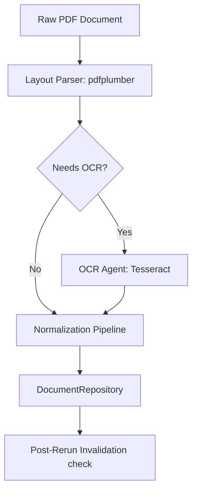
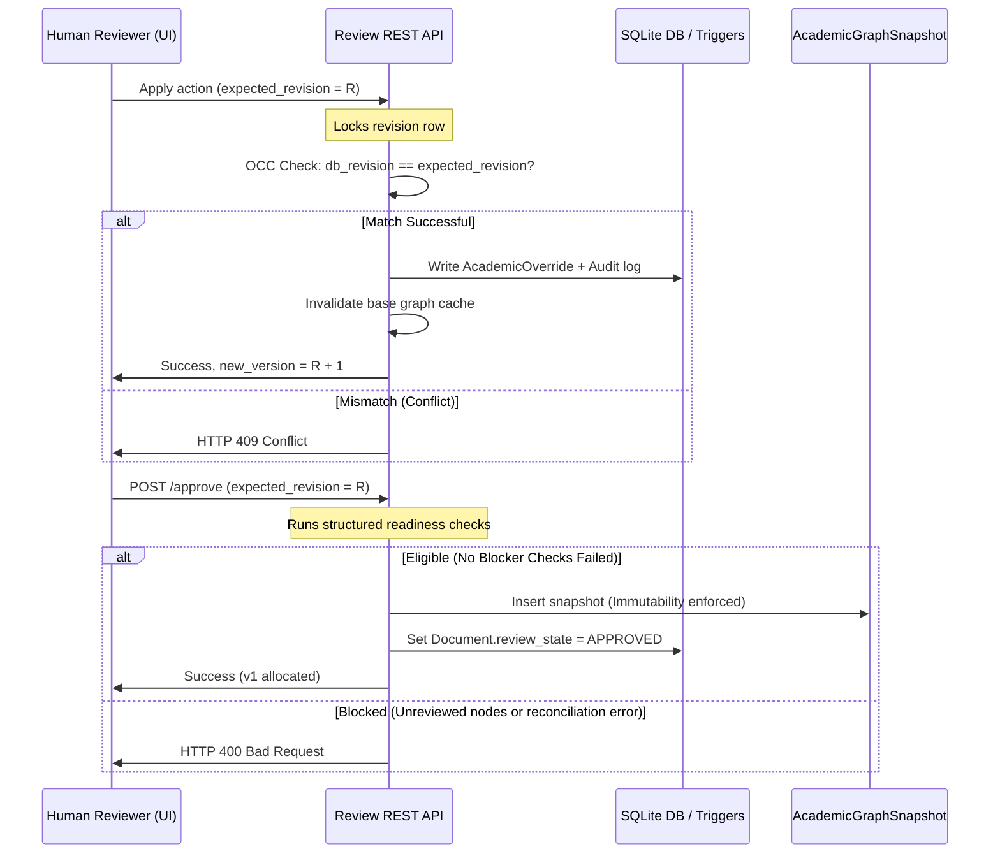

# LectureAI Phase 6–10 Master Context File

This document serves as the **architectural source of truth** for Phases 6–10 of the LectureAI project. It is a permanent reference designed to prevent architectural drift, ensure conformance with established boundaries, preserve human validation data, and guide subsequent developers and agents during multi-session implementations.

---

## 1. Executive Summary & Repository Analysis

LectureAI is an **AI-powered document and lecture intelligence system** that transforms unstructured academic documents (PDFs) into structured, validated, and interactive educational representations.

### Core Stack
* **Backend**: Python 3.13, FastAPI, SQLAlchemy, SQLite (with triggers for data integrity)
* **Frontend**: React 18, TypeScript, Tailwind CSS / Vanilla CSS, React Router, Lucide Icons, `@tanstack/react-query`
* **Parsing & Extraction**: Agnostic layout extraction (`pdfplumber`), custom OCR agent (`pytesseract`), deterministic text normalization pipeline
* **Graph Architecture**: Dual graph system separating physical layout structure (`DocumentGraph`) from conceptual, pedagogical structures (`AcademicGraph`)

### Discovered Repository Architecture

```text
LectureAI Workspace Root
├── backend/
│   ├── app/
│   │   ├── agents/          # Agent orchestration (document_agent, ocr_agent)
│   │   ├── api/             # FastAPI route routers and endpoints
│   │   ├── core/            # Config settings and logging
│   │   ├── db/              # SQLAlchemy engine and session creation
│   │   ├── models/          # DB Schemas (document.py, review.py)
│   │   ├── repositories/    # Database CRUD (document_repository, review_repository)
│   │   ├── schemas/         # Pydantic schemas (review, document, academic)
│   │   └── services/        # Normalization, extraction, overlay, and review services
│   └── tests/               # Pytest suite (88 passing unit tests)
├── frontend/
│   ├── src/
│   │   ├── components/      # Reusable UI widgets
│   │   ├── contexts/        # React contexts (Theme, settings, upload)
│   │   ├── pages/           # Pages (AcademicReviewPage, DocumentPreviewPage)
│   │   ├── services/        # Api clients (reviewService, documentService)
│   │   └── types/           # Type declarations (review.ts)
│   └── vite.config.ts       # Frontend builder config
└── docs/                    # Architectural documents and master context
```

---

## 2. Ingest, OCR, and Normalization Pipelines

The ingestion flow is coordinated by `run_document_agent` in [document_agent.py](file:///c:/Users/rohit/Downloads/ALL%20projects/LectureAI/backend/app/agents/document_agent.py):



### 1. Extraction / OCR Pipeline
* **Layout Parsing**: Native PDF elements (character coordinates, text lines, images, tables) are extracted to establish reading order.
* **OCR Strategy**: Evaluated per-page (AUTO/FORCE/NEVER). When scanned layers are detected, layout coordinate spaces are scaled to merge OCR-extracted text blocks back into the canonical model.

### 2. Normalization Pipeline
Executes a sequence of deterministic, pipeline-ordered normalizers configured via `NormalizationPipeline`:
* `ControlCharacterNormalizer`: Strips invalid control characters.
* `EmptyBlockNormalizer`: Discards empty blocks and cleans spacing.
* `UnicodeNormalizer`: Normalizes text representation (NFKD).
* `WhitespaceNormalizer`: Cleans up redundant inline spaces.
* `HyphenationNormalizer`: Resolves trailing word hyphenation split across line endings.
* `HeaderFooterNormalizer`: Matches repeating headers/footers based on vertical boundaries and suppresses/classifies them.
* `ParagraphNormalizer`: Aggregates disjointed text blocks into logical paragraphs.

---

## 3. Dual-Graph Architecture & Intelligence Engine

The extraction results feed into the `IntelligenceEngine` which resolves topological dependencies of registered analysis modules:

```text
Module Ordering (Topological Resolve):
FeatureExtraction -> HeadingDetection -> ListQuoteNoteDetection -> TableCaptionDetection -> 
CodeFormulaDetection -> ReadingOrderResolver -> HierarchyBuilder -> HierarchyValidation -> 
DocumentQuality -> AcademicFeatureEngine -> CurriculumClassification -> 
ExpositoryClassification -> PedagogicalClassification -> AcademicGraphBuilder -> AcademicQuality
```

### 1. DocumentGraph (`DocumentReadingGraphAnnotation`)
* Wraps the raw blocks in a traversal facade.
* Connects nodes using physical/layout relationship types (`PARENT_CHILD`, `SIBLING`, `CONTAINS`, `NEXT`, `PREV`, `READING_FLOW`, `CAPTION_ASSOCIATION`).
* Provides helper interfaces for subtree traversal (`get_ancestors`, `get_descendants`, `get_section`, `get_document_path`).

### 2. AcademicFeatureEngine & Classifiers
* **AcademicFeatureEngine**: Evaluates typographic scale, indentation levels, mathematical notation, and syntactic keywords (e.g. "Definition 1", "Exercise 2").
* **Classifiers**: Map layout categories onto academic types:
  * **Curriculum**: Outline chapters and section blocks.
  * **Expository**: Annotate informational containers (explanations, concepts).
  * **Pedagogical**: Annotate interactive/teaching elements (definitions, proofs, formulas, algorithms, examples, exercises, summaries).

### 3. AcademicGraphBuilder & AcademicQualityModule
* **AcademicGraphBuilderModule**: Creates conceptual nodes and `CONTAINS` edges. Incorporates a **stable anchor key hashing algorithm** (`resolve_anchor_keys_for_nodes`) to ensure nodes maintain stable identities across pipeline updates.
* **AcademicQualityModule**: Aggregates metrics (completeness, density, structural cycles, and orphans) to calculate an overall academic score.

---

## 4. Completed Human Validation (Phase 5B)

Phase 5B implements user corrections, optimistic concurrency, and approval state auditing.



### 1. Database Schema & Append-only Audit
* **`documents`**: Tracks `review_state` (`NEEDS_REVIEW` or `APPROVED`).
* **`academic_overrides`**: Stores corrections (e.g., `CHANGE_CATEGORY`, `RENAME_TITLE`, `REPARENT_NODE`, `CREATE_NODE`, `DELETE_NODE`, `UPDATE_EDGE`) mapped against anchor keys.
* **`academic_audit_entries`**: Append-only log. Immutability is enforced at the database level by SQLite and PostgreSQL triggers blocking `DELETE` and `UPDATE` operations.
* **`academic_review_revisions`**: Monotonic revision counter for optimistic concurrency control (OCC).
* **`academic_graph_snapshots`**: Immutable snapshots storing approved graphs (`nodes`, `edges`, fingerprints, and reviewer ids). Blocked from updates/deletions via trigger.

### 2. Reconciliation & Invalidation
* **Overlay Reconciliation**: Stale overrides (targeting deleted layout anchors) or conflicting entries are reported in a structured reconciliation summary.
* **Rerun Invalidation Hook**: Hooked into the end of `run_document_agent`. If a document is `APPROVED` and its layout changes during rerun (fingerprint mismatch, new unreviewed nodes, or reconciliation clean-state breaches), the document review state transitions back to `NEEDS_REVIEW` while preserving the historical snapshots.

---

## 5. NON-NEGOTIABLE ARCHITECTURAL BOUNDARY

The Phase 5B approval boundary is authoritative. Any downstream system must adhere to this sequence:

```text
PDF Document
     ↓
DocumentGraph (Physical Layout Flow)
     ↓
AcademicGraph (AI-Generated Concept Types & Edges)
     ↓
Human Review (Reviewer Overrides, Resolving Conflicts)
     ↓
Approved AcademicGraph Snapshot (Immutable Source of Truth)
     ↓
PHASE 6 KNOWLEDGE ENGINE
```

### Mandatory Rules
1. **Snapshots are authoritative**: Phase 6 systems **MUST** consume approved, finalized `AcademicGraphSnapshot` data only.
2. **Read-only Upstream**: Downstream engines **MUST NOT** modify `DocumentGraph`, raw pipeline classifier outputs, or previously committed `AcademicOverride` rows.
3. **No Silent Mutations**: Downstream systems must never automatically "fix" user corrections or bypass validation rules.
4. **No Direct LLM Injection**: LLM interpretations must not overwrite the human-confirmed snapshot. AI inferences must be labeled as such and kept downstream of the approved snapshot.

---

## 6. Remaining Project Roadmap (Phases 6–10)

## Phase 6 — Knowledge Engine

The Knowledge Engine transforms the flat, approved AcademicGraph snapshot and its document block evidence into a structured, versioned, and queryable representation of academic knowledge.

```text
Approved AcademicGraph Snapshot
            ↓
      Knowledge Builder
            ↓
     Knowledge Representation (Concept, Topic, Evidence, Relationships)
            ↓
      Knowledge Store (SQL Database with historical version tracks)
            ↓
      Knowledge Explorer UI (Admin panel to browse nodes and trace evidence)
```

### 6A — Knowledge Model
Define canonical domain models mapped to SQLAlchemy entities:
* **`Concept`**: Core educational ideas (contains stable identifier, name, definition).
* **`Topic`**: Conceptual groups parented by Outline structures.
* **`Definition`**, **`Formula`**, **`Example`**, **`Exercise`**: Pedagogical elements.
* **`Evidence` / `SourceReference`**: Tracks exactly where each knowledge item came from.
  ```text
  Knowledge Item (Concept/Formula) ──> Evidence (Bounding Box, Text block, Page) ──> Document (Upload ID)
  ```
* **`Relationship`**: Link types (`PREREQUISITE_OF`, `ASSOCIATED_WITH`, `COMPOSES`).

### 6B — Knowledge Builder
A deterministic, reproducible transformation service:
* Takes an `AcademicGraphSnapshot` and transforms it into the Knowledge Model.
* No LLM dependencies: the core mapping logic is deterministic.
* Preserves stable node identifiers across reconstructions.
* Does not mutate the source snapshot.

### 6C — Knowledge Store + API
* Persist entities to the existing SQL database.
* Store version metadata (source snapshot ID, builder version, timestamps).
* Keep historic versions intact rather than rewriting rows.
* Expose API routes (`GET /api/v1/knowledge/...`) for lookup and relationship traversal.

### 6D — Knowledge Explorer UI
* Add a tab or view in the frontend to browse generated concepts and relationships.
* Include detail panels showing associated definitions, formulas, examples, exercises, and a link to highlights on the PDF page.
* Do **NOT** implement chat interfaces here. This view is for structural inspection only.

---

## Phase 7 — Retrieval / RAG Engine

A Retrieval Layer built on top of Phase 6 knowledge representations.

```text
User Question ──> Query Parser ──> Graph Traversal ──> Hybrid Text/Semantic Search ──> Context Package
```

* **Concept/Prerequisite Traversal**: Query understanding maps user intent onto concept graph nodes and retrieves related prerequisite concepts.
* **Context Assembly**: Compiles the concept, definition, associated formulas, and the raw source text block passages into a structured context bundle.
* **Semantic & Lexical Retrieval**: Combines keyword search (BM25) with vector search (optional) and ranks results using concept graph provenance weights.

---

## Phase 8 — AI Learning / Reasoning Layer

Generates learning-focused explanations grounded in Phase 7 context.

* **Evidence Grounding**: LLM prompt boundaries must restrict responses to the retrieved evidence.
* **Exposition Controls**: The system should explicitly differentiate between:
  * *Source-Grounded Information*: Concept content verbatim from the approved document.
  * *Model-Generated Explanations*: Pedagogical scaffolding generated by the model.
* **Educational Features**: Generate summaries, practice questions, and formula breakdown step-by-step.

---

## Phase 9 — AI Agents / Orchestration

Coordinates agents handling multi-step tasks.

* **Agent Orchestrator**: Manages specialized subagents:
  * `Retrieval Agent`: Gathers knowledge and passages.
  * `Evaluation Agent`: Validates student answers.
  * `Socratic Agent`: Guides students through exercises without giving away answers.
* **Control Loops**: Ensures agents operate within deterministic state machine boundaries.

---

## Phase 10 — Production Hardening

Operational readiness, monitoring, and scaling.

* **Performance & Polish**: Cache frequently accessed graphs, optimize layout rendering, and implement pagination.
* **DB & Scaling**: Migrate to PostgreSQL for production deployments. Configure robust connection pooling.
* **Observability**: Implement distributed tracing (e.g. OpenTelemetry) for ingestion and LLM calls.

---

## 7. Cross-Phase Architectural Principles

1. **Immutable Academic Approval**: Approved AcademicGraph snapshots are immutable. Once approved, the snapshot's state is frozen.
2. **Downstream Transformation**: All knowledge structures are derived from approved snapshots.
3. **Provenance First**: Every knowledge item must trace back to document block coordinates.
4. **Deterministic Core**: Structural transforms must be reproducible and free from LLM stochastic variation.
5. **Separation of Concerns**: Document parsing, human validation, knowledge representation, and conversational agents are strictly separated.
6. **No Premature AI**: Do not introduce RAG, embeddings, or agent loops until their respective phases are started.
7. **No Premature Infrastructure**: Retain the current relational SQL framework; do not add graph or vector databases without a concrete, measured requirement.
8. **Backward Compatibility**: New phases must not modify tables or break API behavior established in previous phases.
9. **Historical Correctness**: Historical audit logs and approved snapshots must never be retroactively rewritten or truncated.
10. **Modular Extensibility**: Expose stable read APIs from the Knowledge Layer to keep downstream RAG systems decoupled from DB schema changes.

---

## 8. Development & Context Recovery Instructions

### Development Methodology (Rules of Engagement)
For every future phase/sub-phase:
1. Inspect the existing repository implementation to locate exact classes and methods.
2. Do not start coding before dependencies are mapped.
3. Implement backend and frontend in parallel to keep interfaces aligned.
4. Add comprehensive test cases to the pytest suite.
5. Run the complete backend test suite and verify that the regression baseline does not degrade.
6. Run the frontend production build (`npm run build`) to catch TypeScript compilation errors.
7. Only mark a milestone complete after validation.

### Context Recovery (Startup Checklist)
When resuming work on this repository:
1. Read this file.
2. Run `git status` to verify the working tree is clean.
3. Run `python -m pytest` to establish a baseline of passing tests.
4. Identify the active sub-phase requested by the user.
5. Focus **strictly** on the requested sub-phase. Do not implement downstream features prematurely.

---

## 9. Architectural Decision Log

| Date | Phase | Decision | Rationale |
| :--- | :--- | :--- | :--- |
| 2026-08-20 | 5B.2 | SQLite Immutability Triggers | Enforce audit log and snapshot append-only integrity inside the database engine. |
| 2026-08-20 | 5B.6 | Dialect-gated PostgreSQL triggers | Prepare schemas for production targets while maintaining local SQLite test compatibility. |
| 2026-08-20 | 5B.6 | Fingerprint rerun comparison | Restrict state changes to semantic layout differences rather than simple timestamps. |
| 2026-08-21 | 6.0 | SQL-first Knowledge Store | Use relational tables with index mappings for Phase 6 rather than introducing Neo4j. |
| 2026-08-21 | 6A | Active SQLite FK Enforcement | Enabled connection-level SQLite foreign keys dynamically to ensure strict cascading constraint integrity checks during development/tests. |
| 2026-08-21 | 6A | Composite Version Isolation constraints | Bound entities, relationships, and evidence using composite version keys to prevent cross-version graph linkage at the DB schema layer. |
| 2026-08-21 | 6A | Session-Level Flush Mutability Guard | Deployed a single session before_flush listener to validate immutability across all child tables dynamically and prevent self-loops. |
| 2026-08-21 | 6B | Unique Snapshot Constraint & Invariant | Enforced database unique constraint on snapshot_id to guarantee one-to-one mapping and prevent concurrent duplicate version compiles. |
| 2026-08-21 | 6B | Category Contract Filtering | Implemented strict category exclusion filtering to reject UNIT, LEARNING_OBJECTIVE, and other non-finalized models from compiler output. |
| 2026-08-21 | 6B | Snapshot Source-of-Truth Decoupling | Used approved snapshot node titles directly as core text content to decouple compiled entities from mutable, potentially stale DocumentBlock db entries. |
| 2026-08-21 | 6C | Snapshot Approval Version Ordering | Ordered knowledge versions by AcademicGraphSnapshot.approval_version desc to define 'latest finalized' authoritatively instead of transaction timestamps. |
| 2026-08-21 | 6C | Finalized-Only Access Control | Excluded BUILDING versions from the public REST endpoints, returning 404 to isolate incomplete graph data. |
| 2026-08-21 | 6C | Schema Field Harmonization | Mapped database metadata_json columns to metadata field names in public API schemas to match existing Pydantic conventions. |
| 2026-08-21 | 6C | Non-Null page_number Relaxation | Made page_number nullable in database and schemas to cleanly identify missing/stale layout evidence. |
| 2026-08-21 | 6D | Split Panel Read-Only Layout | Designed browser & inspector panels side-by-side on desktop and stacked on mobile with read-only badges. |
| 2026-08-21 | 6D | Localized Title Filter Labeling | Labeled input as "Filter loaded page titles" to clarify it search indexes current visible page instead of server global queries. |
| 2026-08-21 | 6D | Stricter Type metadata Typing | Declared Record<string, unknown> instead of Record<string, any> in TypeScript types to maximize compilation safety. |
| 2026-08-21 | 6D | Independent incoming/outgoing UI columns | Displayed outgoing and incoming edges separately to make link direction explicit. |

---

## 10. Current Project State

* **Current Phase**: Phase 6 — Knowledge Engine
* **Current Sub-Phase**: Phase 6D — Knowledge Explorer Completed
* **Status**: Phase 6 Complete (Ready for Phase 7 Ingestion & Retrieval)
* **Last Completed Milestone**: Phase 6D (Knowledge Explorer Frontend Dashboard, pagination, split layouts, and version details)
* **Known Issues**: None. Backend regression baseline is 100% green (114 tests passing).
* **Next Planned Work**: Phase 7 (Academic Retrieval Engine, embeddings, semantic search, and RAG routes)
* **Last Architectural Review**: 2026-08-21
